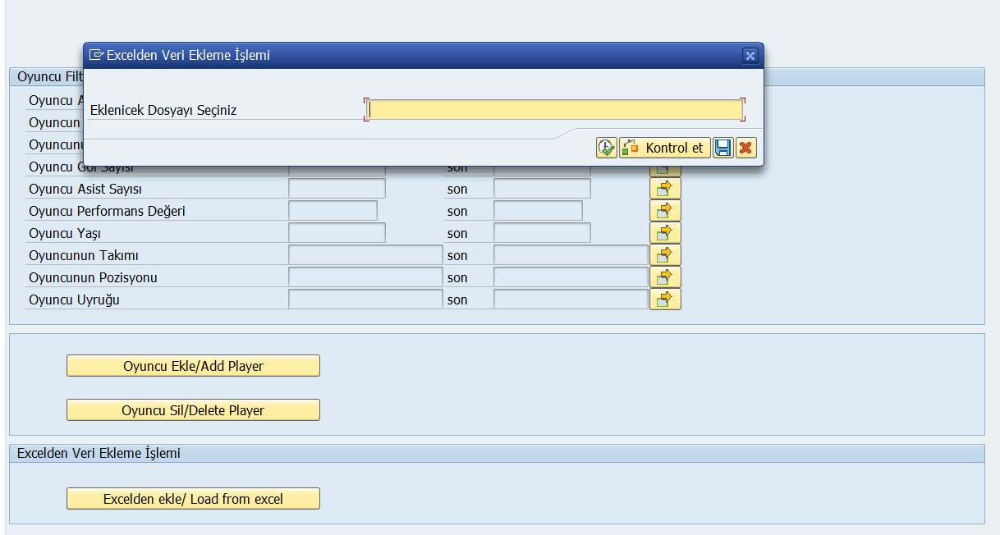
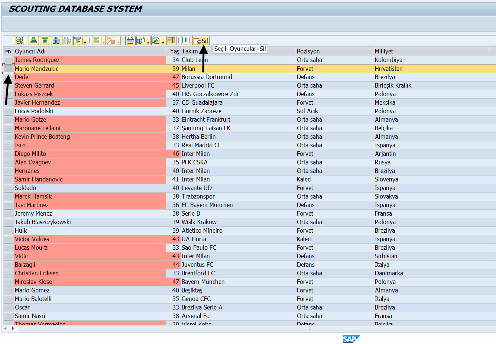

# SAP ABAP Scouting Database System

A football player scouting and statistics management system developed with SAP ABAP. The system allows filtering, adding, deleting, and performance-scoring players via an ALV Grid interface.

---

## Project Structure

| File | Description |
|---|---|
| `Z_EGT_HBS_42_main` | Main program — REPORT declaration, INCLUDEs, START-OF-SELECTION, screen calls |
| `Z_EGT_HBS_42_top` | Global declarations — DATA, TYPES, TABLES |
| `Z_EGT_HBS_42_sel` | Selection screen — SELECT-OPTIONS, PARAMETERS, INITIALIZATION, push buttons |
| `Z_EGT_HBS_42_frm` | Form routines — all business logic (get_data, display_alv, add_player, delete_player, calculate_performance, add_from_excel, delete_selected_players) + `lcl_event_handler` class |
| `Z_EGT_HBS_42_pai` | PAI module — `user_command_0100` (processes user input on screen 0100) |
| `Z_EGT_HBS_42_pbo` | PBO module — `status_0100` (sets menu status and title bar before screen renders) |

---

## Database Tables

| Table | Description |
|---|---|
| `ZPLAYER` | Main player info — name, age, team, position, nationality |
| `ZPLAYER_STATS` | Player statistics — matches, goals, assists, passes, performance score |

---

## Features

- **Player Filtering** — Filter by name, age, team, position, nationality, goals, assists, passes, performance via SELECT-OPTIONS
- **Add Player** — Add a new player through a popup dialog (Screen 0200)
- **Delete Player** — Delete a player by name through a popup dialog
- **Delete Selected** — Select multiple rows in ALV and delete them all at once via custom toolbar button
- **Load from Excel** — Import player data from an Excel file (Screen 0300)
- **Performance Calculation** — Automatically calculates a performance score per player using the formula:

```
Performance = ((Goals × 50) + (Assists × 30) + (Passes / 10)) / Matches
```

- **Cell Coloring** — Rows/cells are color-coded:
  - Red — Performance < 50
  - Orange — Player age > 41

---

## Screenshots

### Selection Screen & Excel Import Dialog


### ALV Grid — Player List with Custom Toolbar


---

## Repository

[https://github.com/hberk44/sap-abap-scouting-database-system.git](https://github.com/hberk44/sap-abap-scouting-database-system.git)

---

## How to Use

1. Clone or import the ABAP includes into your SAP system.
2. Create the `ZPLAYER` and `ZPLAYER_STATS` database tables with matching fields.
3. Activate all includes and the main program.
4. Run transaction `SE38` and execute `Z_EGT_HBS_42`.
5. Use the selection screen to filter players or use the buttons to add/delete/import.

---

## Author

Developed as a SAP ABAP training project.